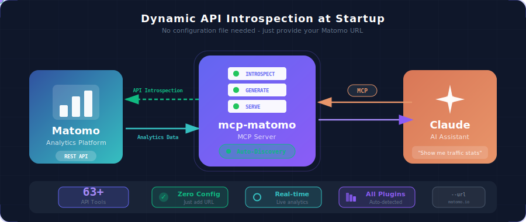

<p align="center">
  
</p>

<h1 align="center">MCP Matomo</h1>

<p align="center">
  <a href="https://github.com/FGRibreau/mcp-matomo/actions/workflows/ci.yml"></a>
  <a href="LICENSE"></a>
  <a href="https://www.rust-lang.org/"></a>
</p>

<p align="center">
  <strong>A Model Context Protocol (MCP) server that exposes your Matomo Analytics API to Claude and other MCP-compatible AI assistants.</strong>
</p>

---

## Sponsors

<table>
  <tr>
    <td align="center" width="200">
      <a href="https://nobullshitconseil.com/">
        <br/>
        <b>NoBullshitConseil</b>
      </a><br/>
      <sub>No-nonsense tech consulting</sub>
    </td>
    <td align="center" width="200">
      <a href="https://www.hook0.com/">
        <br/>
        <b>Hook0</b>
      </a><br/>
      <sub>Open-Source Webhooks-as-a-Service</sub>
    </td>
    <td align="center" width="200">
      <a href="https://france-nuage.fr/">
        <br/>
        <b>France-Nuage</b>
      </a><br/>
      <sub>Sovereign cloud hosting in France</sub>
    </td>
    <td align="center" width="200">
      <a href="https://getnatalia.com/">
        <br/>
        <b>Natalia</b>
      </a><br/>
      <sub>24/7 AI agent for customer service</sub>
    </td>
  </tr>
</table>

> **Interested in sponsoring?** [Get in touch](mailto:rust@fgribreau.com)

## Overview

This project provides two components:

1. **`openapi-gen`** - A CLI tool that introspects your Matomo instance and generates an OpenAPI 3.0 specification
2. **`server`** - An MCP server that reads the OpenAPI spec and exposes all Matomo API methods as tools

## Quick Start

### Prerequisites

- Rust 1.70+ ([install](https://rustup.rs/))
- A Matomo instance with API access
- A Matomo API token (`token_auth`)

### 1. Build the project

```bash
git clone https://github.com/FGRibreau/mcp-matomo.git
cd mcp-matomo
cargo build --release
```

### 2. Generate the OpenAPI specification

```bash
./target/release/matomo-openapi-generator \
  --url https://your-matomo-instance.com \
  --token YOUR_API_TOKEN \
  --site-id 1 \
  --output matomo-api.json
```

<details>
<summary>How to get your Matomo API token</summary>

1. Log in to your Matomo instance
2. Go to **Settings** (gear icon) → **Personal** → **Security**
3. Scroll down to **Auth tokens**
4. Click **Create new token**
5. Give it a name and copy the generated token

</details>

### 3. Test the MCP server

```bash
./target/release/mcp-matomo \
  --openapi matomo-api.json \
  --token YOUR_API_TOKEN
```

The server will start and listen on stdin/stdout for MCP messages.

## Configuration

### Claude Code

Add the following to your Claude Code MCP settings. You can do this via the CLI:

```bash
claude mcp add matomo \
  --command /path/to/mcp-matomo \
  --args "--openapi" "/path/to/matomo-api.json" \
  --env "MCP_MATOMO_TOKEN=YOUR_API_TOKEN"
```

Or manually edit `~/.claude/claude_desktop_config.json`:

```json
{
  "mcpServers": {
    "matomo": {
      "command": "/path/to/mcp-matomo",
      "args": ["--openapi", "/path/to/matomo-api.json"],
      "env": {
        "MCP_MATOMO_TOKEN": "YOUR_API_TOKEN"
      }
    }
  }
}
```

### Claude Desktop

Add to `~/Library/Application Support/Claude/claude_desktop_config.json` (macOS) or `%APPDATA%\Claude\claude_desktop_config.json` (Windows):

```json
{
  "mcpServers": {
    "matomo": {
      "command": "/absolute/path/to/mcp-matomo",
      "args": ["--openapi", "/absolute/path/to/matomo-api.json"],
      "env": {
        "MCP_MATOMO_TOKEN": "YOUR_API_TOKEN"
      }
    }
  }
}
```

## Usage Examples

Once configured, you can ask Claude questions like:

- *"How many visitors did I have yesterday?"*
- *"Show me the top 10 countries by visits this month"*
- *"What are my most popular pages this week?"*
- *"Compare last week's traffic to the week before"*
- *"Which devices are my visitors using?"*

Claude will automatically use the appropriate Matomo API tools to fetch and analyze your analytics data.

## Available Tools

The MCP server dynamically generates tools based on your Matomo instance's API. Below is the complete list of supported Matomo API methods exposed as MCP tools:

### Visits & Traffic Overview

| Tool | Description |
|------|-------------|
| `VisitsSummary_get` | General overview of visitor behavior (visits, pageviews, bounce rate, time on site) |
| `VisitFrequency_get` | Compare returning visitors vs new visitors metrics |
| `API_get` | All available metrics in one comprehensive call |
| `MultiSites_getAll` | Overview metrics for all your websites |
| `MultiSites_getOne` | Overview metrics for a specific website |

### Pages & Content Analytics

| Tool | Description |
|------|-------------|
| `Actions_get` | Basic overview of visitor actions on your website |
| `Actions_getPageUrls` | Most visited page URLs (hierarchical folder structure) |
| `Actions_getPageTitles` | Page titles that have been visited |
| `Actions_getEntryPageUrls` | Entry pages (first page viewed during visits) |
| `Actions_getEntryPageTitles` | Titles of entry pages |
| `Actions_getExitPageUrls` | Exit pages (last page viewed during visits) |
| `Actions_getExitPageTitles` | Titles of exit pages |
| `Actions_getDownloads` | Downloaded files tracking |
| `Actions_getOutlinks` | Outbound links clicked by visitors |
| `Contents_getContentNames` | Content names viewed and interacted with |
| `Contents_getContentPieces` | Content pieces viewed and interacted with |
| `PagePerformance_get` | Page load times and performance metrics |

### Site Search

| Tool | Description |
|------|-------------|
| `Actions_getSiteSearchKeywords` | Keywords searched on your internal search engine |
| `Actions_getSiteSearchNoResultKeywords` | Search keywords that returned no results |
| `Actions_getSiteSearchCategories` | Search categories selected by visitors |
| `Actions_getPageUrlsFollowingSiteSearch` | Pages clicked after internal search |
| `Actions_getPageTitlesFollowingSiteSearch` | Page titles clicked after internal search |

### Traffic Sources & Referrers

| Tool | Description |
|------|-------------|
| `Referrers_get` | Acquisition channels overview |
| `Referrers_getAll` | All referrers (websites, keywords, campaigns) unified |
| `Referrers_getReferrerType` | Distribution by channel type (direct, search, social, etc.) |
| `Referrers_getKeywords` | Search keywords used to find your website |
| `Referrers_getSearchEngines` | Search engines that referred visitors |
| `Referrers_getWebsites` | Referring websites |
| `Referrers_getSocials` | Social networks that led visitors to your site |
| `Referrers_getCampaigns` | Marketing campaigns performance |
| `Referrers_getAIAssistants` | AI assistants that led visitors to your website |

### Visitor Location & Demographics

| Tool | Description |
|------|-------------|
| `UserCountry_getCountry` | Visitors by country |
| `UserCountry_getContinent` | Visitors by continent |
| `UserCountry_getRegion` | Visitors by region/state |
| `UserCountry_getCity` | Visitors by city |
| `UserLanguage_getLanguage` | Browser language settings |
| `UserLanguage_getLanguageCode` | Exact language codes |

### Devices & Technology

| Tool | Description |
|------|-------------|
| `DevicesDetection_getType` | Device types (desktop, mobile, tablet) |
| `DevicesDetection_getBrand` | Device brands/manufacturers |
| `DevicesDetection_getModel` | Device models |
| `DevicesDetection_getBrowsers` | Browser types |
| `DevicesDetection_getBrowserVersions` | Browser versions |
| `DevicesDetection_getBrowserEngines` | Browser rendering engines |
| `DevicesDetection_getOsFamilies` | Operating system families |
| `DevicesDetection_getOsVersions` | Operating system versions |
| `DevicePlugins_getPlugin` | Browser plugins enabled |
| `Resolution_getResolution` | Screen resolutions |
| `Resolution_getConfiguration` | OS + browser + resolution combinations |

### Visitor Engagement

| Tool | Description |
|------|-------------|
| `VisitorInterest_getNumberOfVisitsPerPage` | Visits by number of pageviews |
| `VisitorInterest_getNumberOfVisitsPerVisitDuration` | Visits by duration |
| `VisitorInterest_getNumberOfVisitsByVisitCount` | Visitors by visit count (Nth visit) |
| `VisitorInterest_getNumberOfVisitsByDaysSinceLast` | Returning visitors by days since last visit |

### Time-based Analytics

| Tool | Description |
|------|-------------|
| `VisitTime_getVisitInformationPerServerTime` | Visits by server time |
| `VisitTime_getVisitInformationPerLocalTime` | Visits by visitor's local time |
| `VisitTime_getByDayOfWeek` | Visits by day of week |

### Goals & Conversions

| Tool | Description |
|------|-------------|
| `Goals_get` | Goal conversion overview |
| `Goals_getDaysToConversion` | Days before visitors convert |
| `Goals_getVisitsUntilConversion` | Number of visits before conversion |

### Events Tracking

| Tool | Description |
|------|-------------|
| `Events_getCategory` | Event categories |
| `Events_getAction` | Event actions |
| `Events_getName` | Event names |

### Users & AI

| Tool | Description |
|------|-------------|
| `UserId_getUsers` | Metrics per individual User ID |
| `AIAgents_get` | AI agents tracking |

> **Note:** The exact tools available depend on your Matomo instance configuration and installed plugins. Run the OpenAPI generator to discover all available methods for your specific instance.

## CLI Reference

### openapi-gen

```
matomo-openapi-generator [OPTIONS] --url <URL>

Options:
  -u, --url <URL>            Base URL of the Matomo instance
  -t, --token <TOKEN>        API token (token_auth)
  -c, --cookies <COOKIES>    Authentication cookies (alternative to token)
  -s, --site-id <SITE_ID>    Site ID for API calls [default: 1]
  -o, --output <OUTPUT>      Output file path [default: matomo-openapi.json]
  -d, --delay <DELAY>        Delay between requests in ms [default: 100]
      --fetch-examples       Fetch example responses for schema inference
      --date <DATE>          Date for examples [default: yesterday]
      --period <PERIOD>      Period for examples [default: day]
  -h, --help                 Print help
```

### server (mcp-matomo)

```
mcp-matomo [OPTIONS] --openapi <OPENAPI>

Options:
  -o, --openapi <OPENAPI>    Path to the OpenAPI JSON file
  -t, --token <TOKEN>        Matomo API token (or set MCP_MATOMO_TOKEN env var)
  -h, --help                 Print help
```


## Development

```bash
# Build debug version
cargo build

# Run tests
cargo test

# Run with logging
RUST_LOG=debug ./target/debug/mcp-matomo --openapi matomo-api.json --token YOUR_TOKEN
```

## Troubleshooting

### "No tools available"

Make sure your OpenAPI JSON file is valid and contains paths. Regenerate it with:

```bash
./target/release/matomo-openapi-generator --url YOUR_MATOMO_URL --token YOUR_TOKEN --output matomo-api.json
```

### "401 Unauthorized" errors

1. Verify your API token is correct
2. Check that the token has sufficient permissions
3. Ensure the token is being passed correctly (via `--token` flag or `MCP_MATOMO_TOKEN` env var)

### "Connection refused" or timeouts

1. Verify your Matomo instance is accessible
2. Check for firewalls or VPN requirements
3. Ensure the URL in the OpenAPI spec matches your current Matomo URL

## Contributing

Contributions are welcome! Please feel free to submit a Pull Request.

## License

MIT License - see [LICENSE](LICENSE) for details.

## Acknowledgments

- Built with [rmcp](https://github.com/anthropics/model-context-protocol) - Rust MCP SDK
- Inspired by the [Model Context Protocol](https://modelcontextprotocol.io/) specification
